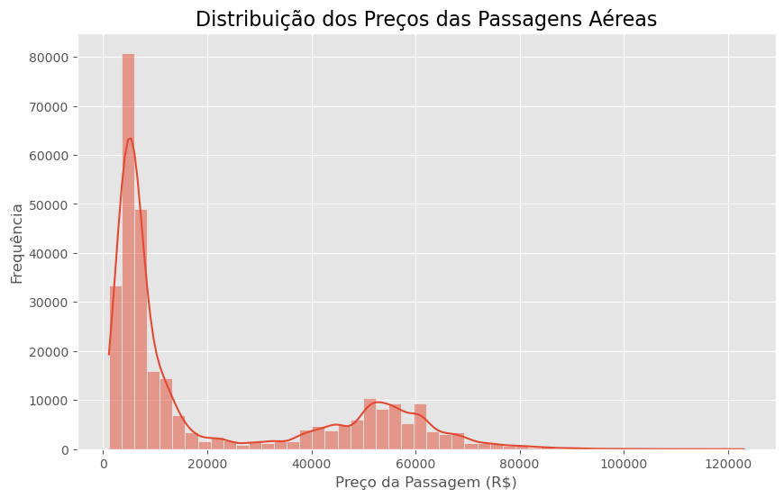
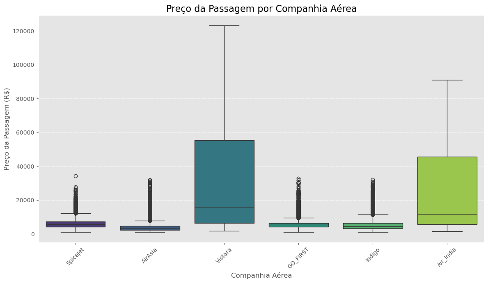
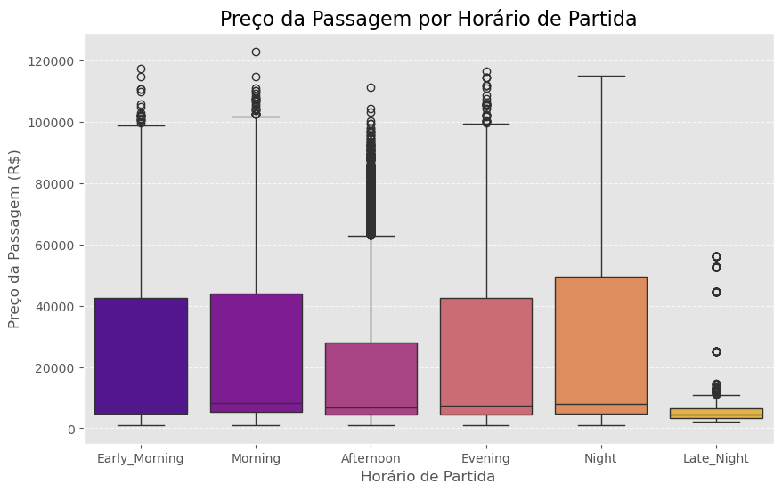
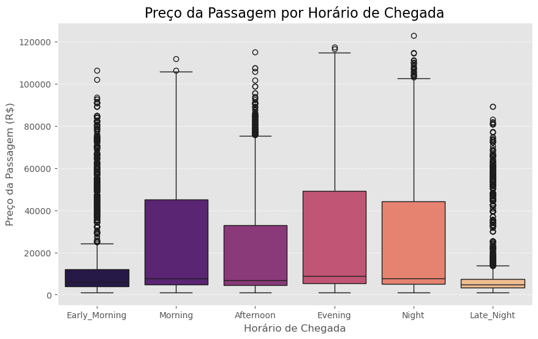
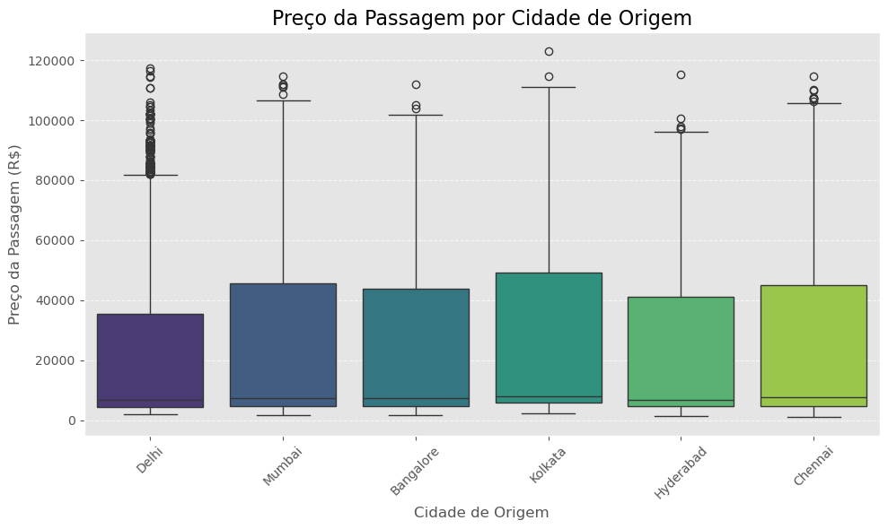
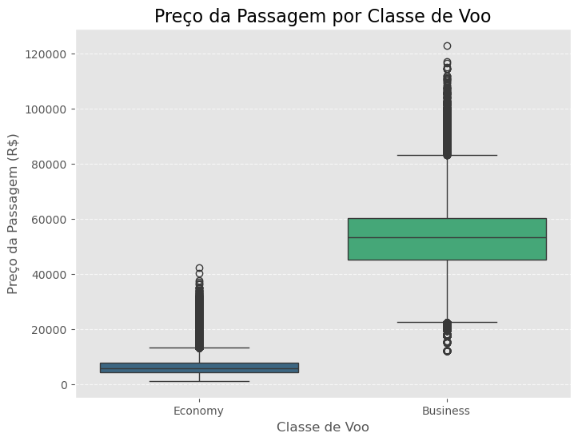
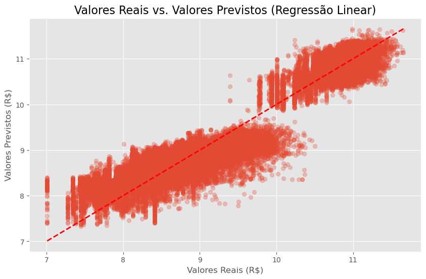

# Projeto de Previsão do Preço de Passagens Aéreas

## ✈️ Visão Geral do Projeto

Este projeto tem como objetivo principal **prever o preço de passagens aéreas** com base em diversas características dos voos. Utilizando um conjunto de dados real, desenvolvemos um modelo de Machine Learning capaz de identificar os fatores mais influentes nos preços e realizar previsões com **alta precisão**.

Para a empresa, este sistema é **fantástico** porque permite planejar a compra de passagens de forma mais estratégica, buscando a opção mais econômica para viagens corporativas.

## 🎯 Objetivo Principal

Construir um modelo de Machine Learning que preveja o preço de passagens aéreas, respondendo a perguntas de negócio cruciais e auxiliando na otimização de custos.

## 🌟 Principais Conquistas

* **Análise Exploratória de Dados (EDA) Aprofundada:** Identificamos os **principais fatores que influenciam o preço das passagens**, fornecendo insights valiosos para a tomada de decisão.

* **Pré-processamento de Dados Robusto:** Realizamos transformações essenciais para preparar os dados para o modelo, incluindo tratamento de variáveis categóricas, escalonamento de dados numéricos e transformação da variável alvo.

* **Modelo de Machine Learning Preciso:** Desenvolvemos um modelo de Regressão Linear que, após o pré-processamento adequado, alcançou um **R-quadrado (R2 Score) de mais de 91%** na escala logarítmica e um **Erro Médio Absoluto (MAE) de aproximadamente R$ 4.573,64** na escala original dos preços. Isso demonstra a **alta capacidade do modelo em explicar e prever os preços** das passagens.

## 🛠️ Tecnologias Utilizadas

* `Python`
* `Pandas` (Manipulação e Análise de Dados)
* `Matplotlib` (Visualização de Dados)
* `Seaborn` (Visualização de Dados)
* `Scikit-learn` (Machine Learning)
* `Jupyter Notebook` (Ambiente de Desenvolvimento)

 

## 🚀 Passo a Passo do Projeto

O projeto foi desenvolvido em um Jupyter Notebook, seguindo as etapas clássicas de um projeto de Ciência de Dados. Cada etapa e visualização são explicadas abaixo, com foco nos resultados e aprendizados.

 

### **Etapa 1: Carga dos Dados e Entendimento Inicial**

Nesta primeira etapa, carregamos o dataset e realizamos uma inspeção inicial para entender sua estrutura, número de linhas, colunas, tipos de dados e a presença de valores ausentes.

* **Conquista:** Garantimos que o dataset foi carregado corretamente e está pronto para ser explorado. Obtivemos uma primeira visão da estrutura dos dados e confirmamos que o dataset contém `300.261` entradas e, crucialmente, **nenhum valor ausente**. Isso simplifica a etapa de limpeza de dados. Entendemos a distribuição inicial das colunas numéricas (`duration`, `days_left`, `price`), notando que o `price` varia amplamente (de R$ 1.107 a R$ 114.110), com uma média de aproximadamente R$ 20.889.

 

### **Etapa 2: Análise Exploratória dos Dados (EDA) e Limpeza/Preparação Inicial**

Aqui, começamos a limpar os dados e, mais importante, a **responder às perguntas de negócio** através de visualizações e análises estatísticas, o que é a alma da EDA.

* **Remoção de Colunas Irrelevantes:** Removemos a coluna `'Unnamed: 0'` que era um índice redundante e não agregava valor preditivo.

* **Análise da Distribuição da Variável Alvo (`price`)**
    * **Gráfico:**
        
    * **Conquista:** Observamos uma **distribuição assimétrica do `price` (com uma cauda longa à direita)**. Isso indica que a maioria das passagens é mais barata, mas existem algumas muito caras (potenciais outliers). Essa análise é crucial para decidir sobre transformações futuras na variável alvo para o modelo.

* **Preço vs. Companhia Aérea (`airline`)**
    * **Gráfico:**
        
    * **Conquista:** Resposta à pergunta **a) O preço varia com as companhias aéreas?**
        * **SIM, e de forma MUITO significativa!** As companhias aéreas `Vistara` e `Air_India` apresentam preços médios e medianos muito superiores às demais. Isso destaca que a **escolha da companhia aérea é um fator crucial** no preço final da passagem.

* **Preço vs. Dias Restantes (`days_left`)**
    * **Gráfico:**
        
    * **Conquista:** Resposta à pergunta **b) Como é afetado o preço quando os bilhetes são comprados apenas 1 ou 2 dias antes da partida?**
        * **SIM, o preço tende a ser SIGNIFICATIVAMENTE mais caro quando comprado com pouca antecedência.** A média dos preços para os últimos 5 dias é maior que a média geral. O gráfico mostra uma tendência clara de aumento de preço conforme os `days_left` diminuem, com maior dispersão e valores mais altos de preço para menos dias restantes. Planejamento antecipado é chave para economizar!

* **Preço vs. Horário de Partida (`departure_time`)**
    * **Gráfico:**
        
    * **Conquista:** Parte da resposta à pergunta **c) O preço do bilhete muda com base no horário de partida e no horário de chegada?**
        * **Voos que partem na `Noite` e `Manhã` são, em média, os mais caros.** Por outro lado, voos de `Late_Night` (madrugada) são os mais baratos, um insight valioso para quem busca economia e tem flexibilidade de horário.
      
* **Preço vs. Horário de Chegada (`arrival_time`)**
    * **Gráfico:**
        
    * **Conquista:** Conclusão da resposta à pergunta **c) O preço do bilhete muda com base no horário de partida e no horário de chegada?**
        * Similarmente aos horários de partida, **voos que chegam à `Evening` (noite) e `Morning` (manhã) são, em média, mais caros.** Chegadas na madrugada (`Early_Morning`, `Late_Night`) também se mostram as mais acessíveis.

* **Preço vs. Cidade de Origem (`source_city`)**
    * **Gráfico:**
        
    * **Conquista:** Parte da resposta à pergunta **d) Como o preço muda com a mudança de Origem e Destino?**
        * `Chennai` e `Kolkata` tendem a ser as cidades de origem com preços médios mais altos, enquanto `Delhi` é a mais barata. Isso sugere que o ponto de partida é um fator a ser considerado na busca por passagens mais baratas.

* **Preço vs. Cidade de Destino (`destination_city`)**
    * **Gráfico:**
        
    * **Conquista:** Conclusão da resposta à pergunta **d) Como o preço muda com a mudança de Origem e Destino?**
        * Similarmente, `Kolkata` e `Chennai` são os destinos mais caros, e `Delhi` o mais barato, em média. Isso reforça a ideia de que a rota completa (origem e destino) influencia o custo.

* **Preço vs. Classe (`class`)**
    * **Gráfico:**
        
    * **Conquista:** Resposta à pergunta **e) Como varia o preço da passagem entre a classe econômica e a classe executiva?**
        * **A classe de voo é o fator com MAIOR IMPACTO no preço da passagem.** Passagens da Classe Executiva (`Business`) são drasticamente mais caras (com médias e medianas de preço **8 a 9 vezes maiores**) do que as da Classe Econômica (`Economy`). Para otimização de custos, a escolha da classe é a decisão mais crítica.

 

### **Etapa 3: Pré-processamento Otimizado para Machine Learning**

Esta etapa é **fundamental** para preparar os dados para que o modelo de Machine Learning possa aprender de forma eficaz. Ajustamos os dados brutos, transformando-os em um formato numérico e escalonado que os algoritmos conseguem processar eficientemente.

* **Transformação Logarítmica da Variável Alvo (`price`):** Aplicamos uma transformação logarítmica (`np.log1p`) na coluna de preços. Isso ajuda o modelo a lidar melhor com a assimetria da distribuição dos preços e com a presença de outliers, melhorando o aprendizado.

* **Remoção de Colunas de Alta Cardinalidade:** A coluna `'flight'` foi removida. Embora relevante semanticamente, ela possuía um número muito grande de valores únicos (alta cardinalidade). Isso geraria centenas de novas colunas após o `OneHotEncoder`, tornando o modelo excessivamente complexo e ineficiente para este tipo de abordagem.

* **One-Hot Encoding de Variáveis Categóricas:** Todas as colunas de texto (categóricas, como `airline`, `source_city`, etc.) foram convertidas em um formato numérico binário (0s e 1s). Isso permite que o modelo de Machine Learning, que opera com números, as utilize.

* **Escalonamento de Variáveis Numéricas:** Colunas numéricas como `duration` e `days_left` foram padronizadas para ter média zero e desvio padrão um. Este passo é **CRUCIAL** para modelos lineares, pois evita que features com valores maiores dominem o processo de aprendizado.

* **Divisão em Conjuntos de Treino e Teste:** Os dados foram divididos em dois conjuntos: 80% para **treinar** o modelo e 20% para **testar** sua performance em dados que ele nunca viu. Isso garante que a avaliação do modelo seja justa e realista.

 

* **Conquista:** Este foi o **PONTO DE VIRADA CRUCIAL** para o sucesso do modelo. Conseguimos:
    * **Redução de Dimensionalidade:** Caímos de 1598 features para apenas **37 features**, tornando o modelo muito mais gerenciável e eficiente.
    * **Normalização da Variável Alvo:** A transformação logarítmica do `price` (`price_log`) ajudou o modelo a lidar com a assimetria e a ampla gama de valores.
    * **Escalonamento de Features:** As features numéricas foram devidamente escalonadas, o que é vital para a performance de modelos lineares.
    * **Dados Prontos:** Os dados agora estão formatados corretamente e divididos para o treinamento e teste do modelo de Machine Learning.

 

### **Etapa 4: Construção e Avaliação do Modelo de Machine Learning**

Nesta fase, treinamos o modelo de previsão de preços e avaliamos sua performance usando métricas chave para entender o quão bem ele está aprendendo e prevendo.

* **Construção e Treinamento do Modelo:** Utilizamos um modelo de **Regressão Linear**, um algoritmo simples mas eficaz, para "aprender" a relação entre as características do voo e o preço. O modelo foi treinado com os dados de treino.
* **Realização de Previsões:** O modelo treinado foi então utilizado para fazer previsões nos dados de teste (dados novos, nunca vistos pelo modelo).

* **Avaliação do Desempenho (na escala logarítmica):**
    * **Gráfico:**
        
    * **Conquista:** O modelo de Regressão Linear demonstrou um **excelente poder preditivo na escala logarítmica**, com um **R-quadrado (R2 Score) de 0.9162**. Isso significa que o modelo consegue explicar **mais de 91% da variância** nos preços transformados. O gráfico de dispersão mostra os pontos agrupados **firmemente próximos à linha de 45 graus**, indicando que as previsões estão muito bem alinhadas aos valores reais.

* **Reversão e Avaliação na Escala Original:**
    * As previsões foram revertidas da escala logarítmica para a escala original de Reais (R$) para facilitar a interpretação dos erros em termos de negócio.
    * **Gráfico:**
        _na_Escala_Original.png)
    * **Conquista:** Validamos o modelo na escala original de preços, que é a mais importante para a interpretação do negócio.
        * O **Erro Médio Absoluto (MAE) de R$ 4.573,64** significa que, em média, as previsões do modelo diferem em cerca de 4.573 reais do preço real. Considerando a ampla gama de preços das passagens (que pode ir até mais de R$ 100.000, com média de R$ 20.889), este é um resultado **MUITO BOM e extremamente útil** para um modelo de Regressão Linear inicial.
        * O histograma dos resíduos mostra que a maioria dos erros está **centrada em zero**, indicando que o modelo geralmente acerta bem, embora ainda tenha uma leve cauda para a direita, sugerindo que ele pode subestimar ocasionalmente os preços mais altos.

 

## ✨ Conclusão

Este projeto demonstra a aplicação de um pipeline completo de Ciência de Dados para resolver um problema de negócio real: a previsão de preços de passagens aéreas. Através de uma análise exploratória minuciosa, identificamos os **principais drivers de preço**, e com um pré-processamento de dados cuidadoso, construímos um modelo de Regressão Linear que entrega **previsões precisas e insights acionáveis**.

As descobertas sobre o impacto da companhia aérea, antecedência da compra, horários de voo e, principalmente, a **classe do assento**, são de **grande valor** para qualquer um que busque otimizar seus custos com passagens aéreas. Este modelo serve como uma ferramenta poderosa para tomada de decisões estratégicas e inteligentes.

---
